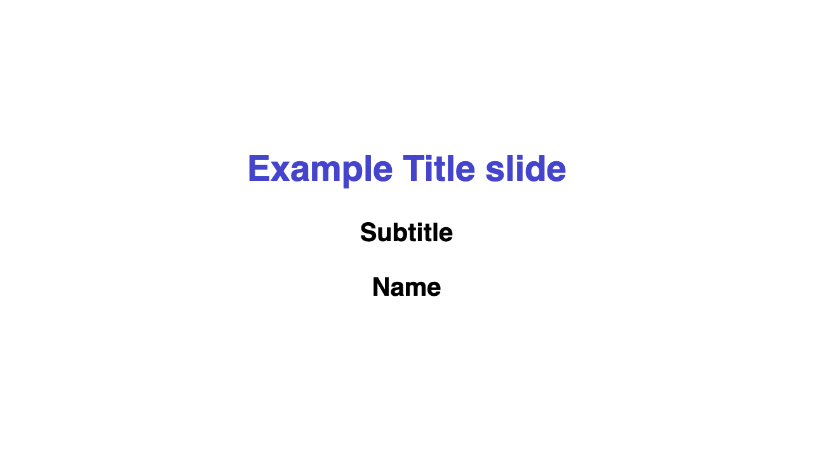
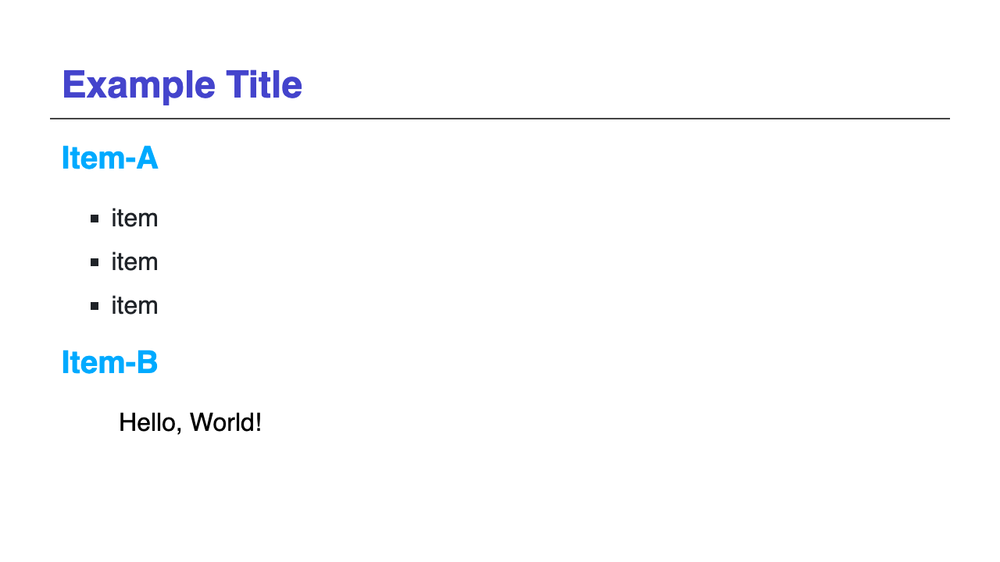

# slide-style

MarpでSlideを作成する際に利用するためのスタイルファイル

## 設定

- 右下にページ数を表示
- footerは中央下に表示
- '> '記号はインデント下げとして使う

### フォント設定

- 本文: MS P Gothic
- Math: IBM Plex Math
- Code: Menlo

- 本文: 32px
- Footer: 24px
- Page number: 26px
- Table: 32 * 85%
- Math: 32 * 120%

## タイトルスライド



```md
---

marp: true
theme: my-style

---
<!-- class: title -->

# Example Title slide
## Subtitle
## Name
```

## 一般スライド



```md
---

marp: true
theme: my-style

---
<!-- class: slide -->

# Example Title
## Item-A
  - item
  - item
  - item
## Item-B
> Hello, World!
```

## 並列スライド


```md
---

marp: true
theme: my-style

---
<!-- class: columns-3 -->

# Example Title

- item
- item
- item


| Column A | Column B |
| -------- | -------- |
| りんご   | Apple    |
| みかん   | Orange   |
```

## Thank you スライド


```md
---

marp: true
theme: my-style

---
<!-- class: thank-you -->

# Thank you
```